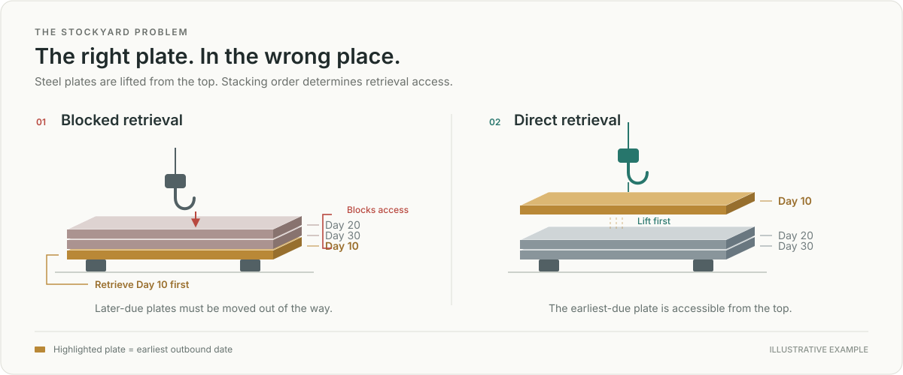

<div align="center">

# Shipyard Stockyard Optimization

### Reinforcement Learning for Industrial Operations

**조선소 강재 적치장의 반출 간섭을 줄이는 AI 기반 재배치 의사결정**


[Overview](#overview) · [Approach](#approach) · [Quick Start](#quick-start) · [Code](#repository-guide) · [Technical Notes](docs/METHODOLOGY.md)

</div>

---

## Overview

조선소 강재 적치장에서는 먼저 반출해야 할 강재 위에 나중에 사용할 강재가 쌓이면 추가 이동이 발생합니다. 적재 공간과 이동 제약을 지키면서 반출 순서까지 고려해야 하므로, 개별 강재의 적치 선택은 이후 작업과 연결되는 의사결정입니다.

이 프로젝트는 석사과정에서 수행한 **조선소 강재 적치·반출 간섭 최소화 연구**를 바탕으로, 적치장 운영을 강화학습 환경으로 모델링하고 **반출 우선순위를 반영하는 GRU와 PPO**를 결합해 재배치 정책을 학습합니다.



*반출 간섭 예시: 먼저 반출할 강재가 아래에 묻히면 간섭이 발생합니다. 두 그림은 적치 순서의 비교 예시입니다.*

## Project Highlights

| 핵심 요소 | 설계 및 구현 |
| :--- | :--- |
| **현장 제약 모델링** | 최상단 강재 이동, 적재 높이 제한, 동적 입고를 반영한 적치장 환경 |
| **우선순위 표현 학습** | 반출일 정보와 pile 표현을 결합하는 priority-aware GRU encoder |
| **강화학습 의사결정** | 출발지·도착지 선택, 유효 행동 마스킹, PPO 기반 actor–critic 학습 |
| **다각도 비교** | Heuristic · Simulated Annealing · Ant Colony Optimization · Gurobi MIP |
| **실험 파이프라인** | 합성 시나리오 생성부터 학습·평가·결과 시각화까지 연결 |

## Approach

### 1. 운영 문제를 학습 환경으로

강재별 반출 우선순위와 pile 상태를 관측하고, **어느 출발지의 최상단 강재를 어느 도착지에 옮길지** 결정합니다. 비어 있는 출발지와 용량을 초과한 도착지는 행동 마스크로 제외합니다.

목표 지표는 재배치 후의 **blocking pair**입니다. 아래 강재가 위 강재보다 먼저 반출되어야 하는 조합을 세어, 적치 상태의 반출 순서 간섭을 정량화합니다.

### 2. 반출 우선순위를 정책에 반영

상단 강재의 반출일과 깊은 층의 요약 통계, 예정 입고 정보 등을 상태로 구성합니다. Priority-aware GRU는 반출 우선순위와 pile embedding을 결합하고, actor–critic 모델은 이를 바탕으로 이동 정책과 상태 가치를 계산합니다.

### 3. PPO로 순차 의사결정 학습

간섭의 변화와 새로 생성된 간섭, 반출일 차이를 보상에 반영합니다. PPO의 clipped objective와 GAE를 사용하며, value loss·entropy regularization·gradient clipping을 함께 적용합니다.

## Optimization Benchmarks

같은 시나리오에서 서로 다른 의사결정 방법을 비교할 수 있도록 평가 코드를 구성했습니다.

| 방법 | 접근 방식 |
| :--- | :--- |
| **Random** | 유효한 출발지와 도착지를 무작위 선택 |
| **EDD–MOD / SOP–MFB** | 반출 우선순위와 적치 상태를 활용하는 규칙 기반 선택 |
| **PPO + Priority-aware GRU** | 상태 표현과 순차 이동 정책을 학습 |
| **Simulated Annealing** | 이동 행동 시퀀스를 변형하며 해 탐색 |
| **Ant Colony Optimization** | 휴리스틱 초기해와 페로몬을 결합한 탐색 |
| **Gurobi MIP** | 이동 순서와 적치 간섭을 수리모형으로 최적화 |

**평가 항목:** 최종 blocking pair 수 · 이동 수 · 실행시간 · 종료 상태

방법별 적용 범위와 시간 측정 기준은 [Technical Notes](docs/METHODOLOGY.md)에 정리했습니다.

## Quick Start

CPU에서 합성 데이터 생성, PPO 학습, baseline 평가와 결과 시각화를 실행할 수 있습니다.

Python 3.10 이상, 저장소 루트 기준입니다.

```bash
python -m venv .venv
# macOS / Linux
source .venv/bin/activate
# Windows PowerShell: .venv\Scripts\Activate.ps1

python -m pip install -r requirements.txt

# Generate a synthetic stockyard scenario
python -m stockyard.data.sample --seed 42

# Run a short PPO training demo
python -m stockyard.training.ppo --updates 2 --horizon 32

# Benchmark policies and optimization methods
python -m stockyard.evaluation.benchmark --methods random edd-mod sop-mfb sa aco ppo

# Visualize the benchmark
python -m stockyard.analysis.plot
```

기본 예제는 강재 24장, 출발지 4개, 도착지 4개입니다. 학습 체크포인트와 평가표·그래프는 `outputs/`에 생성됩니다.

<details>
<summary><strong>동적 입고 시나리오 실행</strong></summary>

```bash
python -m stockyard.data.sample --dynamic --output outputs/dynamic.csv
python -m stockyard.evaluation.benchmark --data outputs/dynamic.csv --methods random edd-mod ppo
```

공개 benchmark의 SA·ACO·Gurobi는 정적 시나리오를 비교 대상으로 사용합니다.

</details>

<details>
<summary><strong>Gurobi MIP 실행</strong></summary>

```bash
python -m pip install -r requirements-gurobi.txt
python -m stockyard.data.sample --sources 2 --destinations 2 --plates-per-source 2 --output outputs/tiny.csv
python -m stockyard.evaluation.benchmark --data outputs/tiny.csv --methods gurobi --budget-seconds 2
```

Gurobi에는 유효한 라이선스가 필요합니다. 모델 크기에 맞는 라이선스를 사용하고, 결과의 종료 상태와 optimality gap을 함께 확인합니다.

</details>

## Repository Guide

| 경로 | 살펴볼 내용 |
| :--- | :--- |
| [Environment](stockyard/environment/yard.py) | 상태 표현, 이동 제약, action mask, 보상 설계 |
| [Models](stockyard/models/network.py) | Priority-aware GRU, encoder 변형, actor–critic |
| [PPO Demo](stockyard/training/ppo.py) | 간결한 학습·체크포인트 생성 흐름 |
| [Research Training](stockyard/training/research_train.py) | 연구용 병렬 rollout 및 학습 흐름 |
| [Baselines](stockyard/baselines/) | Heuristic, SA, ACO, Gurobi 구현 |
| [Evaluation](stockyard/evaluation/) | 정책 rollout 및 공통 benchmark |
| [Data](stockyard/data/) | 강재 모델, 합성 시나리오 생성·로딩 |
| [Analysis](stockyard/analysis/) | 평가 결과 시각화 |
| [Tests](tests/) | 간섭 지표, 이동 제약, 동적 입고, GAE 검증 |

## Engineering & Validation

환경 제약과 학습·평가 코드에 대한 테스트를 제공합니다.

- **동작 검증:** top-only 이동, 적재 용량, padding mask, 동적 입고, 종료 처리
- **학습 검증:** GAE의 종료 처리, 네트워크 출력, 학습·평가 연결
- **실행 검증:** 합성 데이터 생성, PPO 짧은 학습, baseline 비교, Gurobi 소규모 풀이, 그래프 생성
- **자동화:** GitHub Actions에 테스트와 데모 실행 workflow 구성

```bash
python -m pip install -r requirements-dev.txt
python -m pytest -q
```

[Validation Record](docs/VALIDATION.md) · [Implementation Provenance](docs/PROVENANCE.md)

---

## Research & Public Release

이 저장소는 석사 연구 코드를 기반으로 한 **공개용 연구 포트폴리오**입니다. 산업 데이터의 기밀성을 보호하기 위해 독립적으로 생성한 합성 시나리오를 제공하며, 실제 조선소 데이터와 연구 체크포인트는 포함하지 않습니다.

빠른 실행 예제는 학습·평가 파이프라인을 확인하는 데 목적이 있습니다. 논문 실험 결과와 공개 데모의 성능은 구분하며, 모델과 방법별 세부 가정은 아래 문서에서 확인할 수 있습니다.

[Problem Formulation & Methodology](docs/METHODOLOGY.md) · [Source & Adaptation Notes](docs/PROVENANCE.md)

